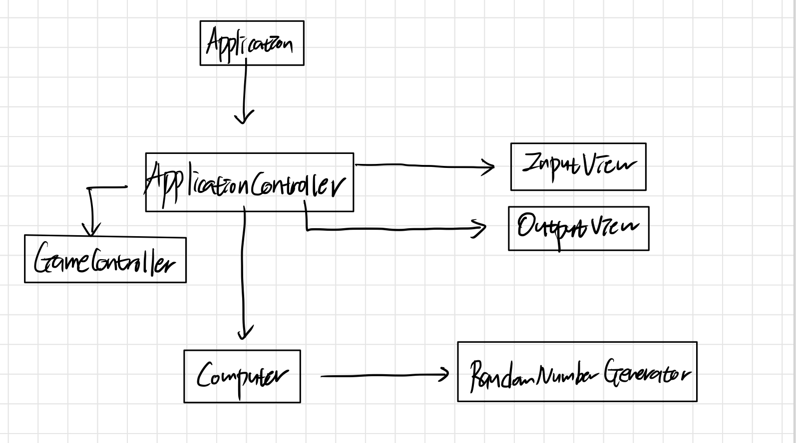

# 자바 연습 - 숫자 야구

# 미션: 숫자 야구 게임

## 구현 기능 목록

### 입출력
- 입력
    - [X] 사용자 입력

- 출력
    - [X] 프로그램 시작 시 "숫자 야구를 시작합니다" 출력
    - [X] "숫자를 입력해주세요 : " 출력
    - [X] 결과값 출력 (볼, 스트라이크, 낫싱)
    - [X] 정답을 맞췄을 시 "3개의 숫자를 모두 맞히셨습니다! 게임 종료" 출력
    - [X] 게임을 계속 진행할 것인지에 대한 여부 출력

### 컴퓨터
- [X] 중복없는 3자리 난수 생성
- [X] 게임 결과 생성

### 게임 컨트롤러
- [X] 게임 상태 관리
    - [X] 숫자 야구 성공 -> 게임 종료
    - [X] 재시작 선택 -> 게임 재실행

### 검증
사용자 입력값 검증
- [X] 서로 다른 3자리 숫자 입력 검증
- [X] 재시작/종료 입력 검증

## 실행 로직

1. 프로그램 실행
2. 컴퓨터가 난수 생성
3. 사용자 입력
    1. 입력값 유효성 검증
4. 숫자 야구 게임 결과 확인
5. 재시작/종료 사용자 입력
    1. 입력값 유효성 검증
6. 재시작/종료

